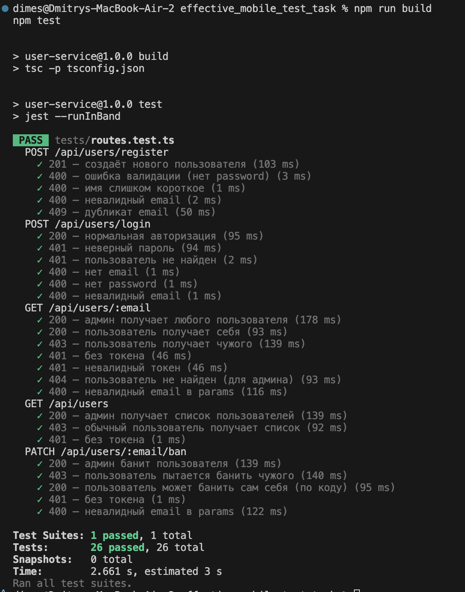

# User Service API

REST API для управления пользователями: регистрация, авторизация, просмотр списка и отдельных пользователей, блокировка.

Проект выполнен как тестовое задание. Все основные сценарии покрыты интеграционными тестами.

---

## 🚀 Технологии

- [Node.js](https://nodejs.org/) + [Express](https://expressjs.com/)
- [TypeScript](https://www.typescriptlang.org/)
- [Prisma](https://www.prisma.io/) (PostgreSQL)
- [Zod](https://zod.dev/) — схема и валидация
- [JWT](https://jwt.io/) — авторизация
- [Jest](https://jestjs.io/) + [Supertest](https://github.com/ladjs/supertest) — тестирование

---

## ⚙️ Установка и запуск

```bash
# 1. Клонировать репозиторий
git clone <repo-url>
cd effective_mobile_test_task

# 2. Установить зависимости
npm install

# 3. Настроить переменные окружения
cp .env.example .env
# В .env указать DATABASE_URL и JWT_SECRET

# 4. Применить миграции Prisma
npx prisma migrate dev

# 5. Запустить проект
npm run dev

# 6. Собрать проект
npm run build
```

---

## ✅ Тесты

Все ключевые сценарии покрыты E2E-тестами (Jest + Supertest):

- `POST /api/users/register`
- `POST /api/users/login`
- `GET /api/users/:email`
- `GET /api/users`
- `PATCH /api/users/:email/ban`

Запуск тестов:

```bash
npm test
```

Результат на момент сдачи:



---

## 📌 Основные эндпоинты

### Регистрация

`POST /api/users/register`

```json
{
  "email": "user@example.com",
  "name": "User",
  "password": "12345678"
}
```

Ответ `201 Created`:
```json
{
  "email": "user@example.com",
  "name": "User"
}
```

---

### Авторизация

`POST /api/users/login`

```json
{
  "email": "user@example.com",
  "password": "12345678"
}
```

Ответ `200 OK`:
```json
{
  "token": "<jwt>"
}
```

---

### Получение пользователя

`GET /api/users/:email`

- Admin → может получить любого
- User → только самого себя

---

### Получение списка пользователей

`GET /api/users`

- Только для `ADMIN`

---

### Блокировка пользователя

`PATCH /api/users/:email/ban`

- Admin → может блокировать любого
- User → может блокировать только себя

---

## 🔒 Авторизация

- Используется JWT (`Authorization: Bearer <token>`)
- Payload токена:
```json
{
  "email": "user@example.com",
  "role": "USER"
}
```

---

## 🛠 Особенности реализации

- Все входные данные валидируются через **Zod**
- Prisma-схема:
  ```prisma
  model User {
    email     String   @id @unique
    name      String
    birthday  DateTime?
    password  String
    role      Role     @default(USER)
    status    Status   @default(ACTIVE)
  }
  ```
- Ошибки уникальности (дубликат email) → `409 Conflict`
- JWT-токены живут 30 минут
- Пароли хэшируются через `bcrypt`

---
